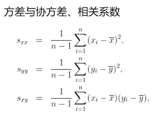
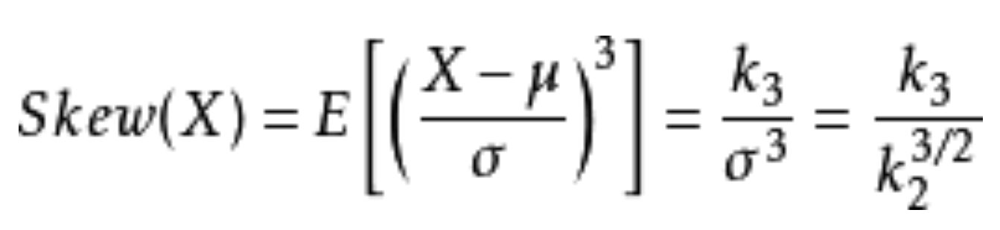

## 方差, 标准差(均方差),协方差, 相关系数


* 常用方差来描述总体数据的离散程度
* 实际计算时, 计算软件一般默认计算样本无偏方差, 前面系数为n-1
* **多维数据的数据集用协方差, 代表了两个变量之间的是否同时偏离均值**
* 协方差为正值，则说明两者是正相关的(从协方差可以引出“相关系数”的定义)
* 协方差df.cov(), 相关系数df.corr()
```
方差: D (X ) = sum [X - E(X)]2 
标准差: sqrt(D(x))
协方差: cov(X, Y) = sum(X-EX)(Y-EY)
当 cov(X, Y)>0时，表明 X与Y 正相关；
当 cov(X, Y)<0时，表明X与Y负相关；
当 cov(X, Y)=0时，表明X与Y不相关。

相关系数 r(X,Y) = cov(X, Y) / (std(X)*std(Y))  --> 注意里面是标准差

相关系数取值范围: [-1, 1]
1、符号：如果为正号，则表示正相关，如果为负号，则表示负相关。
2、取值为0，这是极端，表示不相关；
3、取值为1，表示完全正相关，而且呈同向变动的幅度是一样的；
4、如果为-1，表示完全负相关，以同样的幅度反向变动；

相关系数只能表示线性相关，描述非线性相关性，就需要互信息
```

## 偏度(Skewness)

* 统计数据分布偏斜方向和程度的度量，是统计数据分布非对称程度的数字特征
* 计算时间序列x的偏度，偏度用于衡量x的对称性
* 若偏度为负，则x均值左侧的离散度比右侧强
* 若偏度为正，则x均值左侧的离散度比右侧弱
* 对于正态分布(或严格对称分布)偏度等于0
* 计算偏度: skew()

## 峰度(Kurtosis)


* 正态分布的Kurtosis为K=3，为了描述的方便，使用exceess_K = K-3 来标准化表示
* 如果exceess_K >0, 表示波形更平坦(flatness);
* 如果exceess_K<0, 则表示波形更陡峭(peakedness)
* 计算超额峰度: kurt()

## 分位数(Quantile)

* 分位数，又称分位点，是指将一个随机变量的概率分布范围分为几个等份的数值点
* 常用的有中位数（即二分位数）、四分位数、百分位数等。
* 第一四分位数(Q1)，又称“较小四分位数”，等于该样本中所有数值由小到大排列后第25%的数字；
* 第二四分位数(Q2)，又称“中位数”，等于该样本中所有数值由小到大排列后第50%的数字；
* 第三四分位数(Q3)，又称“较大四分位数”，等于该样本中所有数值由小到大排列后第75%的数字。
* **第三四分位数与第一四分位数的差距又称四分位距**